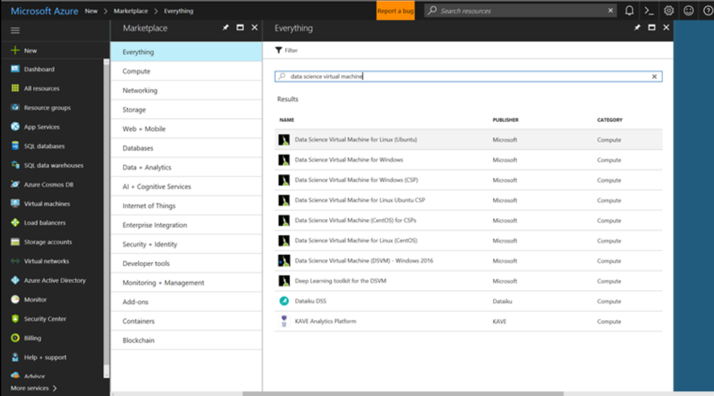
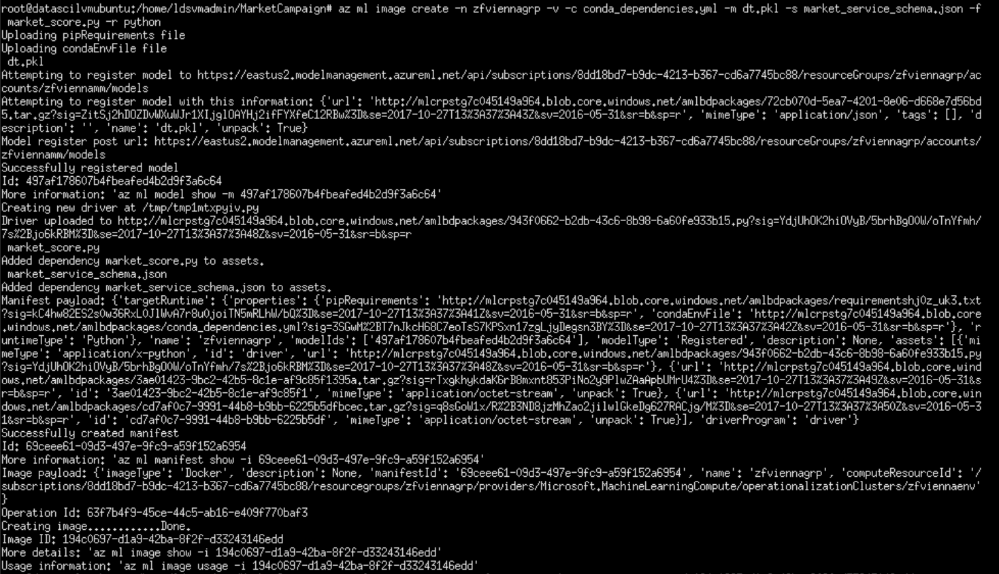
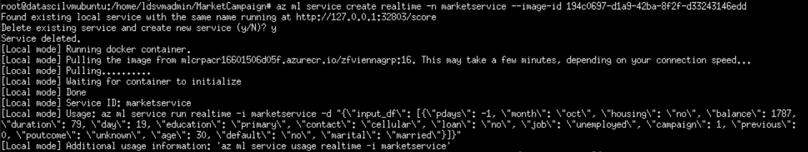
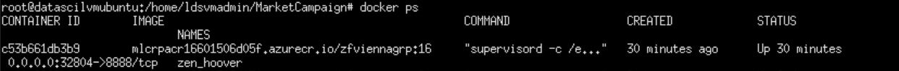
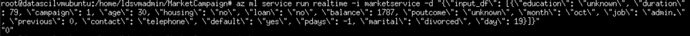

# Tutorial: Market Campaign Prediction

In this tutorial, we show you the basics of Azure ML preview features by creating a data preparation package, building a model and operationalizing it as a real-time web service. To make things simple, we use the timeless [bank market campaign dataset](https://archive.ics.uci.edu/ml/datasets/Bank+Marketing). 

## Step 1. Launch Azure ML Workbench
Follow the [installation guide](https://github.com/Azure/ViennaDocs/blob/master/Documentation/Installation.md) to install Azure ML Workbench desktop application, which also includes command-line interface (CLI). Launch the Azure ML Workbench desktop app and log in if needed.

## Step 2. Create a new project
Click on _File_ --> _New Project_ (or click on the "+" sign in the project list pane). You can also create a new Workspace first from this drop down menu.


Fill in the project name (this tutorial assumes you use `MarketCampaign`). Choose the directory the project is going to be created in (this tutorial assumes you choose `C:\Users\dsvmadmin\Documents\AzureML\MarketCampaign`). Enter an optional description. Choose a Workspace (this tutorial uses `zfviennaws01`). 


>Optionally, you can fill in the Git repo field with an existing empty (with no master branch) Git repo on VSTS. 

Click on _Create_ button to create the project. The project is now created and opened.

## Step 3. Create a Data Preparation package
Open the `BankMarketCampaignTrainingSample.csv` file from the File View, observe that the file is a simple table with 17 columns and 4521 rows. It has 7 numerical feature columns and 10 string feature columns and 1 target column. 


>Note it is not recommended to include data files in your project folder, particularly when the file size is large. We include `BankMarketCampaignTrainingSample.csv` in this template for demonstraction purposes because it is tiny. 

Under Data Explorer view, click on "+" to add a new data source. This launches the _Add Data Source_ wizard. 


Select the _File(s)/Directory_ option, and choose the `BankMarketCampaignTrainingSample.csv` local file. Accept all the default settings for each screen and finally click on _Finish_. 


>Make sure you select the `BankMarketCampaignTrainingSample.csv` file from within the current project directory for this exercise, otherwise latter steps may fail. 

This creates an `BankMarketCampaignTrainingSample-1.dsource` file (because the sample project already comes with an `BankMarketCampaignTrainingSample.dsource` file) and opens it in the _Data_ view. 


Now click on the _Metrics_ button. Observe the histograms and a complete set of statistics that are calculated for you for each column. You can also switch over to the _Data_ view to see the data itself. 


Now click on the _Prepare_ button next to the _Metrics_ button, and this creates a new file named `BankMarketCampaignTrainingSample-1.dprep`. Again, this is because the sample project already comes with an `BankMarketCampaignTrainingSample.dprep` file. It opens in Data Prep editor and shows you the data flow to process the data.

Now close the DataPrep editor. Don't worry, it is auto-saved. Right click on the `BankMarketCampaignTrainingSample.dprep` file, and choose _Generate Data Access Code File_. 


This creates an `BankMarketCampaignTrainingSample.py` file with following four lines of code prepopulated (along with some comments):

```python
# Use the Azure Machine Learning data preparation package
from azureml.dataprep import package

# Use the Azure Machine Learning data collector to log various metrics
from azureml.logging import get_azureml_logger
logger = get_azureml_logger()

# This call will load the referenced package and return a DataFrame.
# If run in a PySpark environment, this call returns a
# Spark DataFrame. If not, it will return a Pandas DataFrame.
df = package.run('BankMarketCampaignTrainingSample.dprep', dataflow_idx=0)

# Remove this line and add code that uses the DataFrame
df.head(10)
```
This code snippet shows how you can invoke the data wrangling logic you have created as a Data Prep package. Depending on the context in which this code runs, `df` can be a Python Pandas DataFrame if executed in Python runtime, or a Spark DataFrame if executed in a Spark context. 

## Step 4. View Python Code in `BankMarketCampaignModeling.py` File
Now, open the `BankMarketCampaignModeling.py` file.


Observe that this script does the following tasks:
1. Invoke the DataPrep package `BankMarketCampaignTrainingSample.dprep` as the data source to generate a [Pandas](http://pandas.pydata.org/) dataframe

2. Encode categorical columns to dummies.

3. Use [scikit-learn](http://scikit-learn.org/stable/index.html) machine learning library to train and evaluate Logistic Regression, Support Vector Machine and Decision Tree models with simple parameter sweeping . 

4. Serialize the model using [pickle](https://docs.python.org/2/library/pickle.html) into a file in a special `outputs` folder, loads it and de-serializes it back into memory.

Also, pay special attention to the run_logger object in the Python code. It records the model accuracy into logs that are automatically plotted in the run history.

## Step 5. Run the Python Script on the Local environment from Command-line

Let's run the BankMarketCampaignModeling.py script for the first time. This script requires scikit-learn package. scikit-learn is already installed by Azure ML Workbench. 

Launch the command-line window by clicking on _File_ --> _Open Command-Line Interface_, notice that you are automatically placed in the project folder. In this example, the project is located in `C:\Users\dsvmadmin\Documents\AzureML\MarketCampaign`.

>Important: You must use the command-line window opened from Workbench to accomplish the following steps.

First, make sure you log in to Azure. (The desktop app and CLI uses independent credential cache when authenticating with Azure resources.) You will only need to do this once, until the cached token expires.

```batch
REM login using aka.ms/devicelogin site.
az login

REM list all Azure subscriptions you have access to. 
az account list -o table

REM set the current Azure subscription to the one you want o use.
az account set -s <subscriptionId>

REM verify your current subscription is set correctly
az account show
```
Once authenticated and current Azure subscription context is set, type the following commands in the CLI window.

```batch
REM Kick off an execution of the BankMarketCampaignModeling.py file against local compute context
az ml experiment submit -c local .\code\marketcampaign\BankMarketCampaignModeling.py
```
This command executes the *BankMarketCampaignModeling.py* file locally. After the execution finishes, you should see the output in the CLI window. 


## Step 6. Run the Python Script in a Docker Container 

### a) Run in a local Docker container

If you have a Docker engine running locally, in the command line window, repeat the same command. Note the change the run configuration from _local_ to _docker_. PrepareEnvironment must be set to true in aml_config/docker.runconfig before you can submit.

```batch
REM execute against a local Docker container with Python context
az ml experiment submit -c docker .\code\marketcampaign\BankMarketCampaignModelingDocker.py
```
This command pulls down a base Docker image, lays a conda environment on that base image based on the _conda_dependencies.yml_ file in your_aml_config_ directory, and then starts a Docker container. It then executes your script. You should see some Docker image construction messages in the CLI window. And in the end, you should see the exact same output as step 5.

### b) Run in a Docker container on a remote Linux machine

To execute your script in a Docker container on a remote Linux machine, you need to have SSH access (using username and password) to that remote machine, and that remote machine must have the Docker engine installed. The easiest way to obtain such a Linux machine is to create a [Ubuntu-based Data Science Virtual Machine (DSVM)](https://azuremarketplace.microsoft.com/en-us/marketplace/apps/microsoft-ads.linux-data-science-vm-ubuntu) on Azure. 

Once the VM is created, you can attach the VM as an execution environment by generating a pair of .runconfig and .compute file using the below command. To do so the user can copy the content from any of the existing .runconfig and .compute files and then name the new environment myvm.
```batch
REM create myvm compute target
az ml computetarget attach remotedocker --name "myvm" --address "<id address>" --username "<username>" --password "<password>"
```
Edit the generated _myvm.runconfig_ file under _aml_config_ and change the PrepareEnvironment from default false to true:
```yaml
"PrepareEnvironment": "true"
```
Edit the generated _myvm.runconfig_ file under _aml_config_ and change the Framework from default PySpark to Python:
```yaml
"Framework": "Python"
```
Now issue the same command as you did before in the CLI window, except this time we will target _myvm_:
```batch
REM execute in remote Docker container
az ml experiment prepare -c myvm
az ml experiment submit -c myvm .\code\marketcampaign\BankMarketCampaignModelingDocker.py
```
When the command is executed, the exact same thing happens as Step 6a except it happens on that remote machine. You should observe the exact same output information in the CLI window.

The below images show you an example of docker environment and docker execution.


## Step 7. Explore Run History
After you run the BankMarketCampaignModeling.py script a few times in the CLI window, go back to the Azure ML Workbench desktop app.

You can also kick off the run against _local_ or _docker_ environments right from the code window in the desktop app. After you click on the Run button, you will see a new job added to the jobs panel with updating status. 


Now click on the Run History icon. 


You should see BankMarketCampaignModeling.py listed as an item in the run history list. Click on it to see the run history dashboard for this particular script, which includes some graphs depicting metrics recorded in each run, along with the list of runs showing basic information including as created date, status, and duration. 


You can click on an individual run, and explore the details recorded for that run. If the run is still underway, you will see execution messages streaming into the log file window that are opened in the run details page. 


If the run has successfully finished, and you have created output files in the special "outputs" folder, they are listed at the right panel of the run detail page as well.


And if there are images (.png and .jpg are the format we support right now) produced by your script run, they are rendered in the images section.

You can also select up to 3 runs in the run list, and click on the _Compare_ button to compare the selected runs.


## Step 8. Obtain the Pickled Model
In the BankMarketCampaignModeling.py script, we serialize the decision tree model using the popular object serialization package -- pickle, into a file named _dt.pkl_ on disk. Here is the code snippet.

```python
print("Export the model to dt.pkl")
f = open('./outputs/dt.pkl', 'wb')
pickle.dump(dtf, f)
f.close()
```

When you executed the *BankMarketCampaignModeling.py* script using the *az ml experiment submit* command, the model was written to the *outputs* folder with the name *dt.pkl*. This folder lives in the compute target, not your local project folder. You can find it in the run history detail page and download this binary file by clicking on the download button next to the file name. 


Now, download the model file _dt.pkl_ and save it to the root of your  project folder. You will need it in the later steps.

## Step 9. Prepare for Operationalization Locally using a DSVM on Azure

Local mode deployments run in Docker containers on your local computer, whether that is your desktop or a Linux VM running on Azure. You can use local mode for development and testing. The Docker engine must be running locally to complete the operationalization steps as shown in the following steps.

Let's prepare the operationalization environment. 

Launch a Data Science Virtual Machine (Ubuntu) from portal.azure.com as shown below. Follow the steps to create the virtual machine on selection and ssh into the machine.



Pip is a better alternative to Easy Install for installing Python packages. To install pip on ubuntu run the bellow command:

```
sudo apt-get install python-pip
```

Only users with sudo access will be able to run docker commands. Optionally, add non-sudo access to the Docker socket by adding your user to the docker group.

```
sudo usermod -a -G docker $(whoami)
```

If you encounter "locale.Error: unsupported locale setting" error, perform the below export:

```
export LC_ALL=C
```

Update pip to use the latest:

```
pip install --upgrade pip
```

Update azure to the latest:

```
pip install --upgrade azure
```
Install azure-cli and azure-cli-ml using pip:

```
pip install azure-cli
pip install azure-cli-ml
```
In addition, change python default version and run the following commands. 

Create a bash_aliases file

```gedit ~/.bash_aliases```

Open your ~/.bash_aliases file and add the following and save it to home directory

```alias python=python3```

Source the ~/.bash_aliases file

```source ~/.bash_aliases```

Setup azure ml environment

```
az ml env setup -n <environment name> -g <resource group> -l <location>
az ml env set -g <resource group> -n <environment name>
```
To verify that you have properly configured your operationalization environment for local web service deployment, enter the following command:

```batch
az ml env local
```

## Step 10. Create a Realtime Web Service

### Schema and Score

To deploy the web service, you must have a model, a scoring script, and optionally a schema for the web service input data. The scoring script loads the dt.pkl file from the current folder and uses it to produce a new predicted class. 

To generate the schema files, execute the market_schema_gen.py file that comes with the sample project in the AMLWorkbench CLI command prompt using Python interpreter directly.

```
python market_schema_gen.py
```

This will create market_service_schema.json (this file contains the schema of the web service input)

```
Upload the below files to the vm (you could use scp to perform the upload):
conda_dependencies.yml
dt.pkl
market_service_schema.json
market_score.py
```

Edit the conda_dependencies.yml to contain only the following dependencies:

```
dependencies:
  - pip:
    # This is the operationalization API for Azure Machine Learning. Details:
    # https://github.com/Azure/Machine-Learning-Operationalization
    - azure-ml-api-sdk
```

### Model Management

The real-time web service requires a modelmanagement account. This can be created using the following commands:

```
az group create -l <location> -n <group name>
az ml account modelmanagement create -l <location> -g <resource group> -n <account name>
az ml account modelmanagement set -n <account name> -g <resource group>
```
The following command creates an image which can be used in any environment.

```
az ml image create -n zfviennagrp -v -c conda_dependencies.yml -m dt.pkl -s market_service_schema.json -f market_score.py -r python
```


You will find the image id displayed when you create the image. Use the image id in the next command to specify the image to use. 

```
az ml image usage -i 194c0697-d1a9-42ba-8f2f-d33243146edd
```
In some cases, you may have more than one image and to list them, you can run ```az ml image list```

Ensure local is used as the deployment environment:
```
az ml env local
```
In local mode, the CLI creates locally running web services for development and testing.
Change to root:
```
sudo -i
```

### Real-time Web Service

Create a realtime service by running the below command using the image-id. In the following command, we create a realtime service called marketservice.

```
az ml service create realtime -n marketservice --image-id 194c0697-d1a9-42ba-8f2f-d33243146edd 
```
An example of a successful run of az ml service create looks as follows. In addition, you can also type docker ps to view the container.





To test the service, execute the returned service run command as follows. For example, the command that is executed below is:
```
az ml service run realtime -i marketservice -d "{\"input_df\": [{\"day\": 19, \"education\": \"unknown\", \"poutcome\": \"unknown\", \"age\": 30, \"default\": \"yes\", \"marital\": \"divorced\", \"loan\": \"no\", \"housing\": \"no\", \"contact\": \"telephone\", \"month\": \"oct\", \"balance\": 1787, \"campaign\": 1, \"job\": \"admin.\", \"duration\": 79, \"pdays\": -1, \"previous\": 0}]}"
```


## Congratulations!
Great job! You have successfully run a training script in various compute environments, created a model, serialized the model, and operationalized the model through a Docker-based web service. 

